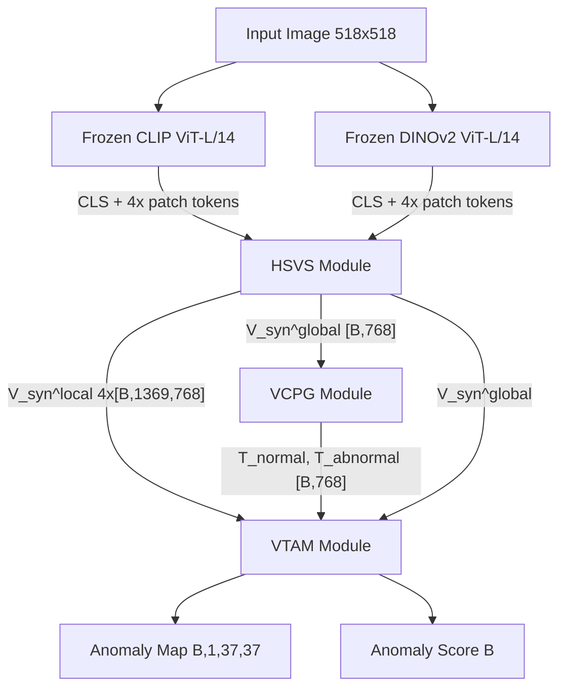

# SSVP Technical Walkthrough: Complete Codebase Reference

> **Paper**: *Synergistic Semantic-Visual Prompting for Industrial Zero-Shot Anomaly Detection*
> arXiv:2601.09147v2

---

## Table of Contents

1. [Architecture Overview](#1-architecture-overview)
2. [Project Structure](#2-project-structure)
3. [Configuration — `configs/default.yaml`](#3-configuration)
4. [Frozen Backbones — `models/backbones.py`](#4-frozen-backbones)
5. [HSVS Module — `models/hsvs.py`](#5-hsvs-module)
6. [VCPG Module — `models/vcpg.py`](#6-vcpg-module)
7. [VTAM Module — `models/vtam.py`](#7-vtam-module)
8. [Loss Functions — `models/losses.py`](#8-loss-functions)
9. [Main Orchestrator — `models/ssvp.py`](#9-main-orchestrator)
10. [Data Transforms — `data/transforms.py`](#10-data-transforms)
11. [Dataset Loader — `data/mvtec.py`](#11-dataset-loader)
12. [Utility Functions — `utils.py`](#12-utility-functions)
13. [Training Script — `train.py`](#13-training-script)
14. [Inference Script — `inference.py`](#14-inference-script)
15. [Tensor Shape Reference](#15-tensor-shape-reference)

---

## 1. Architecture Overview

The SSVP framework is a Vision-Language Model (VLM) for **zero-shot industrial anomaly detection**. It detects anomalies in product images without having seen any anomalous examples from the target domain during training.



The design has three core insights:

1. **CLIP provides semantic understanding** (what objects mean) but lacks fine-grained structural awareness
2. **DINOv2 provides structural features** (edges, textures, shapes) but lacks semantic context  
3. **The fusion of both**, guided by vision-conditioned prompts, enables discriminating anomalies from normal patterns without prior defect examples

> [!IMPORTANT]
> Only the three trainable modules (HSVS, VCPG, VTAM) are optimized during training. The CLIP and DINOv2 backbones remain **completely frozen**, which keeps GPU memory usage tractable (~72M trainable vs ~600M frozen parameters).

---

## 2. Project Structure

```
ssvp/
├── configs/
│   └── default.yaml           # All hyperparameters (§4.2 of paper)
├── models/
│   ├── __init__.py             # Package exports
│   ├── backbones.py            # Frozen CLIP + DINOv2 feature extractors
│   ├── hsvs.py                 # Hierarchical Semantic-Visual Synergy
│   ├── vcpg.py                 # Vision-Conditioned Prompt Generator
│   ├── vtam.py                 # Visual-Text Anomaly Mapper
│   ├── losses.py               # All loss functions
│   └── ssvp.py                 # Main model orchestrator
├── data/
│   ├── __init__.py             # Package exports
│   ├── transforms.py           # Dual-resolution image transforms
│   └── mvtec.py                # MVTec-AD dataset loader
├── train.py                    # Training loop with gradient accumulation
├── inference.py                # Evaluation and visualization
├── utils.py                    # Metrics, post-processing, helpers
├── test_shapes.py              # Shape verification tests
└── requirements.txt            # Python dependencies
```

---

## 3. Configuration

**File**: [default.yaml](file:///c:/Users/vivek/Desktop/Antigrav/ssvp/configs/default.yaml)

The configuration file maps directly to the paper's Section 4.2 (Implementation Details). Every hyperparameter has a corresponding paper reference.

### Backbone Section

| Parameter | Value | Rationale |
|-----------|-------|-----------|
| `clip_model` | `ViT-L-14` | Paper uses CLIP ViT-L/14 for semantic features |
| `dino_model` | `dinov2_vitl14` | DINOv2 ViT-L/14 fallback (DINOv3 weights unavailable) |
| `clip_input_size` | `518` | Ensures patch_size=14 divides evenly: 518/14 = 37 |
| `clip_feature_layers` | `[6, 12, 18, 24]` | 4 intermediate layers for multi-scale features |
| `dino_feature_layers` | `[6, 12, 18, 23]` | DINOv2 ViT-L has 24 blocks; layer 23 = penultimate |

### HSVS Section

| Parameter | Value | Paper Ref |
|-----------|-------|-----------|
| `d_clip` / `d_dino` | `1024` | Hidden dimension of ViT-L models |
| `d_proj` | `768` | Shared synergistic projection dimension |
| `d_head` | `128` | Per-head dimension → 6 heads x 128 = 768 inner dim |
| `num_heads` | `6` | Multi-head attention in ATF blocks |
| `num_layers` | `4` | 4 scale levels matching feature_layers |

### VCPG Section

| Parameter | Value | Paper Ref |
|-----------|-------|-----------|
| `n_normal_prompts` / `n_abnormal_prompts` | `3` | 3+3 learnable prompt templates (§4.2) |
| `bg_context_len` | `4` | 4 shared background tokens |
| `state_context_len` | `4` | 4 state-specific tokens |
| `d_latent` | `256` | VAE latent space dimension |
| `alpha_init` | `0.0` | Gate starts closed — learned during training |

### Training Section (RTX 3050 Optimized)

| Parameter | Value | Rationale |
|-----------|-------|-----------|
| `batch_size` | `2` | Reduced from paper's 8 for 4-8GB VRAM |
| `grad_accum_steps` | `4` | Effective batch = 2 x 4 = 8 (matches paper) |
| `lr_prompt` | `5e-4` | Higher LR for prompt embeddings (§4.2) |
| `lr_network` | `1e-4` | Lower LR for network parameters (§4.2) |
| `mixed_precision` | `true` | FP16 halves memory usage |
| `epochs` | `15` | Paper's training duration |

---

## 4. Frozen Backbones

**File**: [backbones.py](file:///c:/Users/vivek/Desktop/Antigrav/ssvp/models/backbones.py) (320 lines)

This file contains **four classes** that together provide all raw features from frozen pre-trained models.

### 4.1 CLIPFeatureExtractor

**Purpose**: Extract multi-scale semantic features from a frozen CLIP ViT-L/14.

**How it works**:

1. Loads `ViT-L-14` via [OpenCLIP](https://github.com/mlfoundations/open_clip) with OpenAI pretrained weights
2. **Freezes** all parameters (`requires_grad = False`)
3. Registers **forward hooks** on transformer blocks at layers `[6, 12, 18, 24]` to capture intermediate representations

**Hook mechanism**:
```python
# When resblock[layer_idx] runs its forward pass, the hook
# captures the output tensor automatically
transformer.resblocks[layer_idx].register_forward_hook(hook_fn)
```

**Output format**:
- `global_feat`: `[B, 1024]` — CLS token from the final hooked layer (layer 24)
- `local_feats`: a list of 4 tensors, each `[B, 1369, 1024]` — patch tokens from layers 6, 12, 18, 24

The CLS token is removed from each local feature tensor (`feat[:, 1:, :]`) since only the 37x37 = 1369 patch tokens carry spatial information.

> [!NOTE]
> OpenCLIP's ViT processes tensors in `[seq_len, batch, dim]` format internally. The code handles the transpose to `[batch, seq_len, dim]` after extraction.

### 4.2 DINOFeatureExtractor

**Purpose**: Extract multi-scale structural features from a frozen DINOv2 ViT-L/14.

Structurally identical to CLIPFeatureExtractor but uses `torch.hub.load("facebookresearch/dinov2", "dinov2_vitl14")`. DINOv2's self-supervised training objective (self-distillation with no labels) gives it superior fine-grained structural features compared to CLIP, which excels at semantic understanding.

**Output**: Same format as CLIP — `global_feat [B, 1024]` + `local_feats [B, 1369, 1024] x4`.

**Why DINOv2 instead of DINOv3?** The paper specifies DINOv3 ViT-L/16, but those weights are not publicly released. DINOv2 ViT-L/14 is used as a drop-in replacement with the same hidden dimension (1024) but patch_size=14 instead of 16. This means both backbones share the same input resolution, which actually simplifies the implementation.

### 4.3 CLIPTextEncoder

**Purpose**: Encode learnable prompt embeddings through the frozen CLIP text transformer to map them into CLIP's shared vision-language space.

Key method: `encode_text_embeddings(text_embeddings)`:
1. Adds positional embeddings to the input
2. Passes through the CLIP text transformer with a causal attention mask
3. Applies final LayerNorm
4. Extracts the feature at the last (or EOT) token position
5. Projects via `text_projection` to the shared embedding space

### 4.4 DualBackbone

**Purpose**: Orchestrates both visual backbones + the text encoder under a single interface.

Wrapping class that combines `CLIPFeatureExtractor` + `DINOFeatureExtractor` + `CLIPTextEncoder`. The `forward()` method simply calls both visual encoders and returns all four feature groups:

```
DualBackbone.forward(clip_images, dino_images)
    → clip_global, clip_locals, dino_global, dino_locals
```

---

## 5. HSVS Module

**File**: [hsvs.py](file:///c:/Users/vivek/Desktop/Antigrav/ssvp/models/hsvs.py) (231 lines)

**Paper Section**: §3.1 — Hierarchical Semantic-Visual Synergy

### 5.1 The Problem HSVS Solves

CLIP and DINOv2 represent images in fundamentally different ways:
- **CLIP**: Encodes *what* an object is (semantic identity), but tends to blur fine structural details
- **DINOv2**: Encodes *how* surfaces and structures look (edges, textures), but lacks semantic context

A scratch on a bottle is semantically meaningful for anomaly detection — you need both CLIP's understanding that "this is a bottle surface" and DINOv2's ability to see the fine scratch texture.

### 5.2 ATFBlock — Adaptive Token Features Fusion

This is the core building block. Each ATFBlock fuses CLIP and DINO features at a single scale using **dual-path cross-modal attention**.

**Mathematical formulation**:

**Step 1 — Projection to shared subspace** (Eq. 2):

Both feature sets are projected into a common dimensionality to enable cross-attention:

$$Q_c = F_c^l \cdot W_Q^c, \quad K_d = F_d^l \cdot W_K^d, \quad V_d = F_d^l \cdot W_V^d$$

$$Q_d = F_d^l \cdot W_Q^d, \quad K_c = F_c^l \cdot W_K^c, \quad V_c = F_c^l \cdot W_V^c$$

Where:
- $F_c^l \in \mathbb{R}^{B \times N \times D_{clip}}$ — CLIP features at layer $l$
- $F_d^l \in \mathbb{R}^{B \times N \times D_{dino}}$ — DINO features at layer $l$
- All projections map to `inner_dim = num_heads x d_head = 6 x 128 = 768`

**Step 2 — Dual cross-attention** (Eq. 3):

```
Path 1 (CLIP ← DINO):  Attn_{c→d} = Softmax(Q_c · K_d^T / sqrt(d_head)) · V_d
Path 2 (DINO ← CLIP):  Attn_{d→c} = Softmax(Q_d · K_c^T / sqrt(d_head)) · V_c
```

Path 1 injects DINOv2's structural priors into CLIP's semantic space. Path 2 reinforces DINO's structural features with CLIP's semantic context.

**Implementation**: Standard multi-head scaled dot-product attention:

```python
def _multi_head_attention(self, Q, K, V):
    # Reshape: [B, N, inner_dim] → [B, num_heads, N, d_head]
    Q = Q.view(B, N, self.num_heads, self.d_head).transpose(1, 2)
    K = K.view(B, M, self.num_heads, self.d_head).transpose(1, 2)
    V = V.view(B, M, self.num_heads, self.d_head).transpose(1, 2)
    
    attn_weights = (Q @ K.T) / sqrt(d_head)      # [B, H, N, M]
    attn_weights = softmax(attn_weights, dim=-1)
    out = attn_weights @ V                         # [B, H, N, d_head]
    
    return out.reshape(B, N, inner_dim)
```

**Step 3 — Concatenation + LayerNorm** (Eq. 4):

$$Z_{joint} = [\text{LN}(\text{Attn}_{c \to d}) \| \text{LN}(\text{Attn}_{d \to c})]$$

The two attention outputs are individually normalized and concatenated along the feature dimension, producing `[B, N, 2*d_proj]`.

**Step 4 — MLP fusion + residual** (Eq. 5):

$$V_{syn}^l = F_c^l \cdot W_{res} + \text{MLP}(Z_{joint})$$

The MLP is a 2-layer network: `Linear(2*d_proj → 4*d_proj) → GELU → Dropout → Linear(4*d_proj → d_proj)`.

The residual connection comes from CLIP (not DINO) because CLIP's semantic features serve as the primary representation, with DINO information added as structural enrichment.

> [!TIP]
> When `d_clip != d_proj`, a projection matrix `W_{res}` aligns dimensions for the residual. When they match, it's an identity operation.

### 5.3 HSVS — Multi-Scale Application

The full HSVS module applies ATF blocks at two levels:

1. **Local features** (4 scales): One ATFBlock per scale level, processing the 37x37 = 1369 patch tokens:
   ```
   v_syn_locals[l] = ATFBlock_l(clip_locals[l], dino_locals[l])   # [B, 1369, 768]
   ```

2. **Global feature** (1 block): A separate ATFBlock processes the CLS tokens:
   ```
   v_syn_global = ATFBlock_global(clip_CLS, dino_CLS)   # [B, 768]
   ```

**Spatial alignment**: If CLIP and DINO produce different spatial resolutions at any layer (unlikely with both using patch_size=14, but handled defensively), bilinear interpolation aligns them before the ATF block processes them.

---

## 6. VCPG Module

**File**: [vcpg.py](file:///c:/Users/vivek/Desktop/Antigrav/ssvp/models/vcpg.py) (426 lines)

**Paper Section**: §3.2 — Vision-Conditioned Prompt Generator

### 6.1 The Problem VCPG Solves

Static text prompts like "a photo of a normal bottle" and "a photo of a damaged bottle" are used in CLIP-based anomaly detection, but they:
- Cannot adapt to the specific visual content of each image
- Cannot capture the latent distribution of anomaly patterns
- Are limited by the expressiveness of hand-crafted language

VCPG replaces static prompts with **learnable, vision-conditioned** prompts that dynamically adapt based on what the model sees in each image.

### 6.2 PromptBank — Structured Learnable Embeddings (§3.2.1)

**Concept**: Instead of tokenizing text strings, we learn continuous embedding vectors directly.

Each prompt template follows the structure:

$$t = [\mathbf{V}]_{bg}, [\mathbf{V}]_{state}, [\text{CLASS}]$$

Where:
- `[V]_bg` — **Shared background vectors** (`[4, 768]`): These 4 learnable tokens capture domain-invariant environmental context (e.g., "industrial product on conveyor belt under lighting"). They are **shared** across all normal and abnormal prompts, which forces them to learn common contextual patterns.
  
- `[V]_state` — **State-specific vectors** (`[n, 4, 768]` per state): These 4 learnable tokens per prompt are **separate** for normal vs. abnormal, capturing discriminative features. Normal prompts learn representations of "intact, smooth, uniform" while abnormal prompts learn "scratched, broken, discolored".

- `[CLASS]` — Optional class name embedding from CLIP's vocabulary (e.g., the token for "bottle").

**Why this decoupled design?** By sharing `[V]_bg`, the model is forced to factorize its representations: background context doesn't get entangled with anomaly-specific features, improving generalization to unseen object categories.

**Implementation**:
```python
class PromptBank(nn.Module):
    bg_vectors     = nn.Parameter(randn(4, 768) * 0.02)        # Shared
    normal_state   = nn.Parameter(randn(3, 4, 768) * 0.02)     # 3 normal prompts
    abnormal_state = nn.Parameter(randn(3, 4, 768) * 0.02)     # 3 abnormal prompts
```

Each prompt is assembled by concatenation: `bg_vectors || normal_state[i]` → `[8, 768]` per prompt.
Total: 3 normal prompts and 3 abnormal prompts, each with 8 tokens of dimension 768.

### 6.3 VAEModule — Variational Visual Modeling (§3.2.2)

**Purpose**: Encode the global visual feature $V_{syn}^{global}$ into a compact latent distribution that captures the anomaly state of the image.

**Encoder** (Eq. 7):

$$\mu = F_\mu(h), \quad \log \sigma^2 = F_\sigma(h), \quad h = \text{GELU}(\text{LN}(V_{syn}^{global} \cdot W_e))$$

Where:
- $W_e \in \mathbb{R}^{768 \times 512}$ — shared encoder projection
- $F_\mu, F_\sigma \in \mathbb{R}^{512 \times 256}$ — parallel heads for mean and log-variance

**Reparameterization** (Eq. 8):

$$z = \mu + \varepsilon \odot \exp(\log \sigma^2 / 2), \quad \varepsilon \sim \mathcal{N}(0, I)$$

This trick enables gradient flow through the stochastic sampling operation. During inference, $z = \mu$ for deterministic outputs.

**Decoder** (reconstruction):

$$\hat{V} = W_d^2 \cdot \text{GELU}(\text{LN}(z \cdot W_d^1))$$

Where: $W_d^1 \in \mathbb{R}^{256 \times 512}$, $W_d^2 \in \mathbb{R}^{512 \times 768}$

The decoder exists to provide a reconstruction loss signal during training. It is not used independently during inference.

### 6.4 TextLatentCrossAttention (§3.2.2, Eq. 10)

**Purpose**: Allow the text prompt embeddings to dynamically query and incorporate visual information from the latent variable $z$.

$$\delta_{inj} = \text{Softmax}\left(\frac{Q \cdot K^T}{\sqrt{d_k}}\right) \cdot V$$

Where:
- $Q = T_{init} \cdot W_Q \in \mathbb{R}^{B \times N_{tokens} \times 256}$ — text as queries
- $K = z \cdot W_K \in \mathbb{R}^{B \times 1 \times 256}$ — latent as key (single token)
- $V = z \cdot W_V \in \mathbb{R}^{B \times 1 \times 768}$ — latent as value

Since the key sequence has only 1 token (the latent $z$), the softmax attention is effectively a content-dependent scaling of the value projection. The 4-head attention allows different heads to focus on different aspects of the latent encoding.

### 6.5 Gated Injection (§3.2.3, Eq. 11)

$$T_{final} = \text{LayerNorm}(T_{init} + \alpha \cdot \delta_{inj})$$

The scalar gate $\alpha$ is initialized to **0.0**, meaning the model starts with pure text prompts and gradually learns to inject visual information. This prevents the visual signal from overwhelming the prompt semantics early in training.

### 6.6 Full VCPG Pipeline

```
V_syn^global ─┬─→ VAE.encode() → (μ, log σ²)
              │                    ↓
              │              reparameterize → z
              │                    │
              │    ┌───────────────┘
              │    ↓
T_init ───────┼──→ TextLatentCrossAttn(T_init, z) → δ_inj
              │                    │
              └──→ T_final = LN(T_init + α · δ_inj)
                   └── Normal prompts: [B, 3, 8, 768]
                   └── Abnormal prompts: [B, 3, 8, 768]
```

The `get_aggregated_prompt_features()` method reduces these to `[B, 768]` by averaging across all prompts and sequence positions.

---

## 7. VTAM Module

**File**: [vtam.py](file:///c:/Users/vivek/Desktop/Antigrav/ssvp/models/vtam.py) (236 lines)

**Paper Section**: §3.3 — Visual-Text Anomaly Mapper

### 7.1 The Problem VTAM Solves

Naive CLIP-based anomaly scoring computes a single cosine similarity between visual and text features. This creates a **global-local disconnect**: the global score may say "normal" while a small region is clearly anomalous, or vice versa. VTAM resolves this with:

1. **Per-pixel anomaly maps** at multiple scales
2. **Dual gating** to weight scales and spatial regions adaptively
3. **Score enhancement** that combines global and local evidence

### 7.2 Per-Layer Anomaly Probability (Eq. 13-14)

For each scale $l$, the anomaly probability at each spatial position is computed via cosine similarity between the patch token and the aggregated prompt embeddings:

**Step 1 — Dense cosine similarity** (Eq. 13):

$$S_{normal}(h,w) = \frac{V_{syn}^{l}(h,w) \cdot T_{normal}}{|V_{syn}^{l}(h,w)| \cdot |T_{normal}|}$$

$$S_{abnormal}(h,w) = \frac{V_{syn}^{l}(h,w) \cdot T_{abnormal}}{|V_{syn}^{l}(h,w)| \cdot |T_{abnormal}|}$$

**Step 2 — Temperature-scaled softmax** (Eq. 14):

$$P_{anom}^l(h,w) = \frac{\exp(S_{abnormal}(h,w) / \tau)}{\exp(S_{normal}(h,w) / \tau) + \exp(S_{abnormal}(h,w) / \tau)}$$

Where $\tau = 0.07$ is a learnable temperature parameter. Lower temperature makes the distribution sharper (more decisive), while higher temperature produces softer probabilities.

**Implementation** (efficient vectorized form):
```python
v_norm = F.normalize(v_local, dim=-1)              # [B, N, D]
t_norm_n = F.normalize(t_normal, dim=-1)            # [B, D]
sim_normal = einsum("bnd,bd->bn", v_norm, t_norm_n) # [B, N]
sim_abnormal = einsum("bnd,bd->bn", v_norm, t_norm_a)
sim_stack = stack([sim_normal, sim_abnormal], dim=-1)
probs = softmax(sim_stack / tau, dim=-1)
p_anom = probs[:, :, 1].view(B, 1, H, W)
```

### 7.3 AnomalyMoE — Dual-Gated Aggregation

The Anomaly Mixture-of-Experts treats each scale's anomaly map as an "expert" and combines them using two complementary gating mechanisms:

**Branch A — Global Scale Gating** (Eq. 15):

$$w_{scale} = \text{Softmax}(F_{gate}^{global}(V_{syn}^{global}))$$

An MLP maps the global feature to per-layer importance weights:
```
Linear(768 → 384) → GELU → Dropout(0.1) → Linear(384 → 4) → Softmax
```

This produces `w_scale ∈ [B, 4]` — how important each scale is for the current image. For example, fine scratches might emphasize later (higher-resolution) scales, while large structural defects emphasize earlier (lower-resolution) scales.

**Branch B — Local Spatial Gating** (Eq. 16):

$$M_{spatial}^l = \sigma(F_{gate}^{local,l}(V_{syn}^{local,l}))$$

Per-layer 1x1 convolutions produce spatial attention masks:
```
Conv2d(768 → 192, k=1) → GELU → Conv2d(192 → 1, k=1) → Sigmoid
```

This produces `M_spatial ∈ [B, 1, 37, 37]` — where to look within each scale. Regions with more discriminative features get higher mask values.

**Dual-Gated Aggregation** (Eq. 17):

$$P_{map} = \sum_{l=1}^{4} w_{scale}^l \cdot (M_{spatial}^l \odot P_{anom}^l)$$

Each expert's anomaly map is first spatially gated (element-wise multiply with the sigmoid mask), then scaled by the global importance weight, and summed across all 4 scales.

### 7.4 Score Enhancement (Eq. 18-19)

**Local score** (Eq. 18):

$$S_{local} = \max_{h,w} P_{map}(h,w)$$

Global max pooling extracts the peak anomaly probability as the local evidence.

**Final score** (Eq. 19):

$$S_{final} = (1 - \gamma) \cdot S_{global} + \gamma \cdot S_{local}$$

Where $\gamma = 0.5$ balances global semantic evidence ($S_{global}$ = cosine similarity difference between abnormal and normal prompt alignment) with local spatial evidence ($S_{local}$ = peak pixel probability).

---

## 8. Loss Functions

**File**: [losses.py](file:///c:/Users/vivek/Desktop/Antigrav/ssvp/models/losses.py) (241 lines)

**Paper Section**: §3.4

The total training objective combines four losses:

$$\mathcal{L}_{total} = \mathcal{L}_{Seg} + \mathcal{L}_{Class} + \lambda_1 \cdot \mathcal{L}_{VAE} + \lambda_2 \cdot \mathcal{L}_{reg}$$

### 8.1 Focal Loss — $\mathcal{L}_{Seg}$ (Eq. 20)

**Purpose**: Pixel-level segmentation loss that handles severe class imbalance (most pixels are normal).

$$\mathcal{L}_{Seg} = -\frac{1}{H \times W} \sum_{h,w} \left[ Y \cdot (1-p)^\gamma \cdot \log(p) + (1-Y) \cdot p^\gamma \cdot \log(1-p) \right]$$

Where:
- $Y \in \{0, 1\}$ — ground truth pixel label
- $p$ — predicted anomaly probability at that pixel
- $\gamma = 2.0$ — the focusing parameter

The modulating factor $(1-p_t)^\gamma$ down-weights easy examples (correctly classified pixels with high confidence) and focuses training on hard examples (boundary pixels, subtle anomalies). A pixel with 95% correct prediction gets weight $(1-0.95)^2 = 0.0025$, while a 50/50 pixel gets $(0.5)^2 = 0.25$ — a 100x ratio.

### 8.2 BCE Loss — $\mathcal{L}_{Class}$ (Eq. 21)

**Purpose**: Image-level binary classification loss.

$$\mathcal{L}_{Class} = -[y \cdot \log(\sigma(s)) + (1-y) \cdot \log(1-\sigma(s))]$$

Uses PyTorch's `BCEWithLogitsLoss` which combines sigmoid activation with binary cross-entropy for numerical stability.

### 8.3 VAE Loss — $\mathcal{L}_{VAE}$ (Eq. 9)

**Purpose**: Regularize the VAE latent space to be smooth and informative.

$$\mathcal{L}_{VAE} = \|V_{syn}^{global} - D_\theta(z)\|^2 + \beta \cdot D_{KL}(q_\phi(z|V) \| \mathcal{N}(0,I))$$

**Reconstruction term**: MSE between original and reconstructed global features ensures $z$ captures meaningful information.

**KL divergence term**: Pushes the learned posterior toward a standard normal prior:

$$D_{KL} = -\frac{1}{2} \sum_{j=1}^{d_{latent}} \left(1 + \log \sigma_j^2 - \mu_j^2 - \sigma_j^2\right)$$

The weight $\beta = 0.1$ balances reconstruction quality against latent space regularization. Too high makes reconstructions blurry; too low makes the latent space irregular.

> [!NOTE]
> The VAE target uses `.detach()` on $V_{syn}^{global}$, preventing the reconstruction loss from backpropagating through the HSVS module. This keeps the HSVS optimization focused on feature fusion quality rather than VAE-friendly representations.

### 8.4 Margin Regularization — $\mathcal{L}_{reg}$ (Eq. 12)

**Purpose**: Prevent vision-conditioned prompts from drifting too far from their initial semantics.

$$\mathcal{L}_{reg} = \max\left(0, \xi - \cos(T_{final}, \text{sg}(T_{init}))\right)$$

Where:
- $\xi = 0.85$ — minimum cosine similarity threshold
- $\text{sg}(\cdot)$ — stop-gradient operator

This defines a **semantic neighborhood**: the conditioned prompts can freely move within a cosine-similarity sphere of radius $\xi$ around the initial prompts, but are penalized if they drift further. This is crucial because without it, the visual injection could corrupt the learned prompt semantics entirely.

**The loss is computed separately for normal and abnormal prompts and averaged.**

### 8.5 Combined SSVPLoss

The `SSVPLoss` class orchestrates all four losses with configurable weights:

```python
total_loss = l_seg + l_class + lambda_vae * l_vae + lambda_reg * l_reg
# Default: total = focal + bce + 1.0 * vae_elbo + 0.5 * margin_reg
```

Automatic spatial alignment handles cases where the anomaly map resolution doesn't match the mask resolution (nearest-neighbor interpolation).

---

## 9. Main Orchestrator

**File**: [ssvp.py](file:///c:/Users/vivek/Desktop/Antigrav/ssvp/models/ssvp.py) (198 lines)

**Paper Section**: Algorithm 1 — SSVP Inference Pipeline

### 9.1 SSVP Class

This is the top-level `nn.Module` that assembles all components into a single forward pass.

**Initialization**:
```python
self.backbone = DualBackbone(config)    # ~600M frozen params
self.hsvs = HSVS(...)                  # ~55M trainable params
self.vcpg = VCPG(config)               # ~2M trainable params
self.vtam = VTAM(...)                  # ~15M trainable params
```

### 9.2 Forward Pipeline (Algorithm 1)

```
Input: image [B, 3, 518, 518]
│
├── Stage 1: Feature Extraction (torch.no_grad)
│   └── backbone(image) → clip_global, clip_locals, dino_global, dino_locals
│
├── Stage 2: HSVS Feature Fusion
│   └── hsvs(clip_*, dino_*) → v_syn_global [B, 768], v_syn_locals 4x[B, 1369, 768]
│
├── Stage 3: Vision-Conditioned Prompts
│   └── vcpg(v_syn_global) → t_final_normal, t_final_abnormal,
│                              t_init_normal, t_init_abnormal, vae_outputs
│   └── aggregate() → t_norm_agg [B, 768], t_abn_agg [B, 768]
│
└── Stage 4: Anomaly Mapping
    └── vtam(v_syn_locals, v_syn_global, t_norm_agg, t_abn_agg)
        → anomaly_map [B, 1, 37, 37], anomaly_score [B]
```

### 9.3 Parameter Grouping

The `get_trainable_params()` method returns two parameter groups with different learning rate keys:

| Group | Parameters | Learning Rate |
|-------|-----------|---------------|
| `prompt_params` | PromptBank vectors (bg, normal_state, abnormal_state) + alpha gate | `5e-4` |
| `network_params` | HSVS projections, VAE, cross-attention, VTAM gates | `1e-4` |

The prompt embeddings use 5x higher learning rate because they operate in a lower-dimensional manifold and need to converge faster to establish meaningful semantic anchors.

---

## 10. Data Transforms

**File**: [transforms.py](file:///c:/Users/vivek/Desktop/Antigrav/ssvp/data/transforms.py) (120 lines)

### 10.1 DualResizeTransform

Handles the resolution math for both backbones:

**Images**: Resized to `518x518` via bicubic interpolation, normalized with ImageNet statistics `(mean=[0.485, 0.456, 0.406], std=[0.229, 0.224, 0.225])`.

**Why 518?** Both CLIP ViT-L/14 and DINOv2 ViT-L/14 use `patch_size=14`. The spatial grid size must be an integer: `518 / 14 = 37`. The standard 512x512 would give `512/14 = 36.57` (not integer), causing token sequence length issues in the transformer.

**Masks** are produced at two resolutions:
- `mask_tensor [1, 37, 37]` — matches feature grid size for loss computation
- `mask_full [1, 518, 518]` — full resolution for pixel-level evaluation metrics

Both use **nearest-neighbor** interpolation (not bicubic) to preserve binary mask values.

### 10.2 AugmentedTransform

Extends `DualResizeTransform` with training-time augmentations:
- `RandomHorizontalFlip(p=0.5)` — safe for anomaly detection
- `ColorJitter(brightness=0.1, contrast=0.1, saturation=0.05)` — mild photometric augmentation

> [!WARNING]
> Geometric augmentations (rotation, affine, perspective) are intentionally excluded because they would misalign the image with its anomaly mask. The mask transform pipeline does not include the same random augmentations as the image pipeline, so any geometric transform would create incorrect supervision signals.

---

## 11. Dataset Loader

**File**: [mvtec.py](file:///c:/Users/vivek/Desktop/Antigrav/ssvp/data/mvtec.py) (299 lines)

### 11.1 MVTec-AD Dataset Structure

MVTec Anomaly Detection contains 15 categories (5 textures, 10 objects) with:
- **Training**: Only normal ("good") images (~200-300 per category)
- **Testing**: Both normal and anomalous images with pixel-level defect masks

```
mvtec_anomaly_detection/
├── bottle/
│   ├── train/good/            # ~200 normal training images
│   ├── test/
│   │   ├── good/              # 20 normal test images
│   │   ├── broken_large/      # Anomalous test images
│   │   └── broken_small/
│   └── ground_truth/
│       ├── broken_large/      # Binary masks for each defect type
│       └── broken_small/
```

### 11.2 MVTecDataset Class

**Split modes**:
- `"train"` — loads only `train/good/` images (label=0, no mask)
- `"test"` — loads all `test/*/` images (label=0 for good, label=1 for defects, with masks)
- `"all"` — loads both train and test for auxiliary training purposes

**Mask discovery**: The `_find_mask()` method handles MVTec's naming convention where masks may be named `{image_name}_mask.png` or just `{image_name}.png`.

**Each sample returns a dict**:
```python
{
    "image":       Tensor[3, 518, 518],   # Preprocessed image
    "mask":        Tensor[1, 37, 37],     # Binary mask (feature grid)
    "mask_full":   Tensor[1, 518, 518],   # Binary mask (full resolution)
    "label":       int,                    # 0=normal, 1=anomalous
    "category":    str,                    # e.g., "bottle"
    "defect_type": str,                    # e.g., "broken_large"
    "image_path":  str                     # Absolute path
}
```

### 11.3 DataLoader Factory

`get_mvtec_dataloaders(config)` creates:
- **Training loader**: batch_size=2, shuffle=True, augmentations enabled, drop_last=True
- **Testing loader**: batch_size=1, shuffle=False, no augmentations

---

## 12. Utility Functions

**File**: [utils.py](file:///c:/Users/vivek/Desktop/Antigrav/ssvp/utils.py) (293 lines)

### 12.1 Evaluation Metrics

**Image-level** (`compute_image_level_metrics`):

| Metric | Description | Computation |
|--------|-------------|-------------|
| **AUROC** | Area Under ROC Curve | `sklearn.roc_auc_score(labels, scores)` |
| **F1-Max** | Maximum F1 over all thresholds | Sweep precision-recall curve, find max $\frac{2PR}{P+R}$ |
| **AP** | Average Precision | `sklearn.average_precision_score(labels, scores)` |

**Pixel-level** (`compute_pixel_level_metrics`):

| Metric | Description |
|--------|-------------|
| **P-AUROC** | Pixel-level ROC AUC — all pixels flattened |
| **P-AP** | Pixel-level Average Precision |
| **PRO** | Per-Region Overlap — size-invariant metric |

**PRO Score** (`compute_pro_score`):

PRO is a specialized metric for anomaly detection that prevents large defects from dominating the score. It:
1. Labels connected components in the ground truth mask
2. At each threshold, computes the overlap ratio for each connected component separately
3. Averages overlap ratios across components (giving equal weight to small and large defects)
4. Integrates the PRO curve up to FPR=0.3 using trapezoidal integration

### 12.2 Post-Processing

`postprocess_anomaly_map(anomaly_map, target_size, sigma=4.0)`:
1. Upsamples from feature grid `[37, 37]` to full resolution `[518, 518]` via bilinear interpolation
2. Applies Gaussian smoothing ($\sigma = 4.0$) to remove high-frequency noise artifacts

### 12.3 Visualization

`visualize_results()` creates a 3-panel figure:
1. **Input Image** — original deprocessed image
2. **Anomaly Heatmap** — jet colormap overlay on image (alpha=0.5)
3. **Ground Truth** — red mask overlay (optional)

### 12.4 Helpers

- `load_config(path)` — loads YAML config via `yaml.safe_load`
- `set_seed(42)` — sets `torch`, `numpy`, `random` seeds + deterministic CuDNN

---

## 13. Training Script

**File**: [train.py](file:///c:/Users/vivek/Desktop/Antigrav/ssvp/train.py) (316 lines)

**Paper Section**: Algorithm 3

### 13.1 Optimizer Setup

Dual-LR AdamW with weight decay 0.01:

```python
optimizer = AdamW([
    {"params": prompt_params, "lr": 5e-4},    # Prompt bank + alpha
    {"params": network_params, "lr": 1e-4},   # HSVS, VAE, gates
], weight_decay=0.01)
```

### 13.2 Learning Rate Schedule

Cosine annealing with linear warmup:

```
Epoch: 0    1    2    3    ...   14   15
LR:   0 → max → ... (cosine decay) → 0
      └ warmup ┘
```

The lambda function:
```python
if step < warmup_steps:
    return step / warmup_steps          # Linear ramp-up
else:
    progress = (step - warmup) / (total - warmup)
    return 0.5 * (1 + cos(pi * progress))  # Cosine decay
```

### 13.3 Training Loop — Gradient Accumulation

The critical memory optimization for RTX 3050:

```
Iteration 1: forward(batch_1) → loss/4 → backward()   [gradients accumulate]
Iteration 2: forward(batch_2) → loss/4 → backward()   [gradients accumulate]
Iteration 3: forward(batch_3) → loss/4 → backward()   [gradients accumulate]
Iteration 4: forward(batch_4) → loss/4 → backward()   [gradients accumulate]
             → clip_grad_norm(1.0)
             → optimizer.step()
             → optimizer.zero_grad()
             → scheduler.step()
```

Each mini-batch of 2 images requires ~3-4 GB VRAM. Without gradient accumulation, a batch of 8 would require ~12-16 GB. By accumulating over 4 steps, the effective batch size is 8 while peak memory stays at the 2-image level.

### 13.4 Mixed Precision

`torch.cuda.amp.autocast` wraps the forward pass in FP16 mode, halving activation memory. The `GradScaler` handles FP16 backward scaling to prevent underflow.

### 13.5 Validation & Checkpointing

- Validation runs every 3 epochs + the final epoch
- Saves the best checkpoint (by I-AUROC) and periodic checkpoints every 5 epochs
- The progress bar shows live loss, segmentation loss, classification loss, alpha value, and learning rate

---

## 14. Inference Script

**File**: [inference.py](file:///c:/Users/vivek/Desktop/Antigrav/ssvp/inference.py) (259 lines)

### 14.1 Evaluation Pipeline

```
For each test image:
    1. Forward pass → anomaly_map [1, 1, 37, 37] + anomaly_score [1]
    2. Postprocess map: upsample to 518x518 + Gaussian smooth (σ=4)
    3. Accumulate scores/maps per category
```

After processing all images:
```
For each category:
    4. Compute image-level metrics (AUROC, F1-Max, AP)
    5. Compute pixel-level metrics (P-AUROC, PRO, P-AP)
```

### 14.2 Output Format

Results are printed in a formatted table and saved as JSON:

```
Category         I-AUROC   I-F1   I-AP │  P-AUROC  P-PRO   P-AP │     N
─────────────── ──────── ──────── ──── │ ──────── ──────── ──── │ ─────
bottle              98.2    95.1  97.8 │     96.5    91.2  72.3 │    83
cable               ...
...
AVERAGE             ...
```

### 14.3 Optional Visualization

With `--visualize`, saves the first 5 anomalous samples per category as 3-panel PNG images to `eval_results/visualizations/{category}/`.

---

## 15. Tensor Shape Reference

Complete tensor shape trace through the full forward pass with `B=2`:

| Stage | Tensor | Shape | Notes |
|-------|--------|-------|-------|
| **Input** | `image` | `[2, 3, 518, 518]` | RGB, ImageNet-normalized |
| **Backbone** | `clip_global` | `[2, 1024]` | CLS token |
| | `clip_locals[l]` | `[2, 1369, 1024]` | 37x37 patches, 4 layers |
| | `dino_global` | `[2, 1024]` | CLS token |
| | `dino_locals[l]` | `[2, 1369, 1024]` | 37x37 patches, 4 layers |
| **HSVS** | `v_syn_global` | `[2, 768]` | Global synergistic feature |
| | `v_syn_locals[l]` | `[2, 1369, 768]` | Multi-scale local features |
| **ATF internals** | `Q, K, V` | `[2, 1369, 768]` | Projected queries/keys/values |
| | `attn_weights` | `[2, 6, 1369, 1369]` | Multi-head attention matrix |
| | `z_joint` | `[2, 1369, 1536]` | Concatenated LN outputs |
| **VCPG** | `t_init_normal` | `[3, 8, 768]` | 3 prompts x 8 tokens |
| | `t_init_abnormal` | `[3, 8, 768]` | 3 prompts x 8 tokens |
| | `mu, logvar` | `[2, 256]` | VAE latent distribution |
| | `z` | `[2, 256]` | Sampled latent |
| | `delta_inj` | `[2, 24, 768]` | Vision-conditioned residual |
| | `t_final_normal` | `[2, 3, 8, 768]` | Conditioned normal prompts |
| | `t_final_abnormal` | `[2, 3, 8, 768]` | Conditioned abnormal prompts |
| | `t_norm_agg` | `[2, 768]` | Aggregated normal embedding |
| | `t_abn_agg` | `[2, 768]` | Aggregated abnormal embedding |
| **VTAM** | `p_anom_l` | `[2, 1, 37, 37]` | Per-layer anomaly map |
| | `w_scale` | `[2, 4]` | Global scale weights |
| | `m_spatial` | `[2, 1, 37, 37]` | Local spatial mask |
| | `anomaly_map` | `[2, 1, 37, 37]` | Fused anomaly map |
| | `anomaly_score` | `[2]` | Final image-level score |
| **Post-process** | `smoothed_map` | `[2, 518, 518]` | Upsampled + Gaussian blur |
