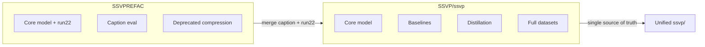

# Workspace Structure

Two trees implement the same SSVP research project. They use an identical **submission layout** but differ in scope, scripts, and maturity.

## Shared submission layout

Both `SSVP/ssvp/` and `SSVPREFAC/DL_Project_refactor/` follow:

| Folder | Purpose |
|--------|---------|
| `01_admin/` | Team info, contribution statements |
| `02_report/` | Final report PDF, LaTeX source |
| `03_code/` | All Python source, configs, scripts |
| `04_data/` | Dataset links, sample inputs, local MVTec copies |
| `05_results/` | Metrics JSON, ablation runs, figures |
| `06_demo/` | Demo instructions and sample inputs |
| `07_claims/` | Reproduced vs contributed work |

Path resolution is centralized in `03_code/scripts/path_utils.py` (identical in both trees):

```python
REPO_ROOT = CODE_DIR.parent          # e.g. ssvp/ or DL_Project_refactor/
DATASETS_DIR = REPO_ROOT / "04_data" / "datasets"
ABLATIONS_DIR = REPO_ROOT / "05_results" / "ablations"
```

Always run scripts from the **repo root** (`ssvp/` or `DL_Project_refactor/`), not from `03_code/`.

## SSVP/ — canonical submission bundle

```
SSVP/
├── ssvp/                          # Main project (01–07)
│   └── 03_code/
│       ├── src/
│       │   ├── models/            # ssvp, hsvs, vcpg, vtam, backbones, losses, lora
│       │   └── data/              # mvtec.py, transforms.py
│       ├── scripts/               # 14 entry-point scripts
│       ├── configs/               # default + student distill YAMLs
│       └── external/              # Vendored AnomalyCLIP + WinCLIP copies
├── external/                      # Top-level AnomalyGPT + WinCLIP
├── tools/winclip_eval.py          # Full WinCLIP eval (wired to external/WinCLIP)
├── results/                       # WinCLIP clean/noisy benchmark CSVs
├── ssvp_technical_walkthrough.md  # Module-by-module architecture reference
└── ssvp_operations_guide.md       # Install, datasets, training, troubleshooting
```

**Strengths**

- Complete baseline ecosystem (WinCLIP, AnomalyCLIP, AnomalyGPT)
- Compression / distillation pipelines still active
- Multi-category dataset support (`prepare_cable_split.py` handles cable, capsule, transistor)
- Rich top-level documentation outside the submission folders
- Full `04_data/datasets/` with resplits

**Direction:** submission-ready, breadth-first (baselines + compression + demo).

## SSVPREFAC/ — refactor / experiment workspace

```
SSVPREFAC/
├── DL_Project_refactor/           # Same 01–07 layout
│   └── 03_code/
│       ├── scripts/
│       │   ├── _deprecated/       # Moved compression/distillation scripts
│       │   ├── evaluate_captions.py
│       │   ├── caption_compare.py
│       │   ├── train_run22.py
│       │   └── ...
│       └── configs/
│           ├── default.yaml
│           └── run22_override.yaml
├── gpu_venv/                      # Committed local env (should be gitignored)
├── .venv/
└── runs/                          # Ad-hoc outputs (run22 caption compare, etc.)
```

**Strengths**

- Caption quality evaluation (`evaluate_captions.py`, BERTScore)
- Run22 prompt-dice experiment track (`train_run22.py`, `run22_override.yaml`)
- Report generation helpers (`generate_reports.py`, `aggregate_run22_results.py`)
- Cleaner script surface — deprecated pipelines moved to `_deprecated/`
- More caption eval artifacts under `05_results/caption_eval_*`

**Weaknesses / gaps vs SSVP**

- No top-level `external/` or `tools/` — WinCLIP eval is a stub (`evaluate_winclip.py`)
- No full dataset copies in `04_data/datasets/`
- Local venvs and `runs/` clutter the tree
- Compression/distillation removed from active scripts (only in `_deprecated/`)

**Direction:** depth-first on captioning and run22 experiments; slimmed operational surface.

## Core model code (`03_code/src/`)

Same module filenames in both trees; **contents differ** in:

| File | Notes |
|------|-------|
| `models/ssvp.py` | REFAC adds caption-target helpers used by eval scripts |
| `models/losses.py` | REFAC may include run22 prompt-dice terms |
| `scripts/train.py` | Training loop divergences (early stopping, supervision flags) |
| `configs/default.yaml` | Hyperparameter drift |

Identical: `path_utils.py`, module skeleton (`hsvs`, `vcpg`, `vtam`, `backbones`, `lora`).

## Results and checkpoints

Both trees reference the same **run21** baseline metrics (97.42% clean image AUROC). REFAC adds extensive caption-eval directories:

- `05_results/caption_eval_smoke/`
- `05_results/caption_eval_full_compare/`
- `05_results/CAPTION_EVAL_SUMMARY.md`

Large `.pth` checkpoints live under `05_results/ablations/` and are gitignored.

## External dependencies map

| Dependency | SSVP location | REFAC equivalent |
|------------|---------------|------------------|
| WinCLIP | `SSVP/external/WinCLIP` + `tools/winclip_eval.py` | Stub only |
| AnomalyCLIP | `ssvp/03_code/external/AnomalyCLIP` | `run_anomalyclip_baseline.py` (no vendored copy) |
| AnomalyGPT | `SSVP/external/AnomalyGPT` | Not present |
| BERTScore | Not in requirements | `requirements.txt` + `evaluate_captions.py` |

## Mental model



See [`MERGE_PLAN.md`](MERGE_PLAN.md) for the step-by-step consolidation.
